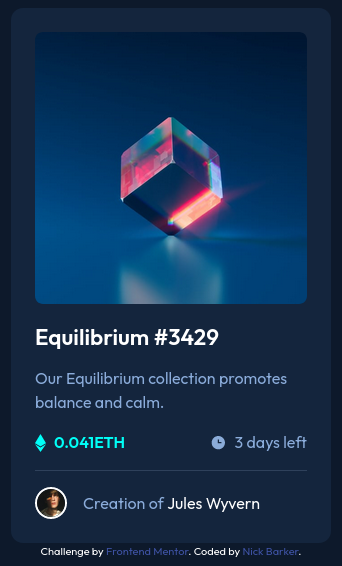

# Frontend Mentor - NFT preview card component solution

This is a solution to the [NFT preview card component challenge on Frontend Mentor](https://www.frontendmentor.io/challenges/nft-preview-card-component-SbdUL_w0U). Frontend Mentor challenges help you improve your coding skills by building realistic projects. 

## Table of contents

- [Overview](#overview)
  - [The challenge](#the-challenge)
  - [Screenshot](#screenshot)
  - [Links](#links)
- [My process](#my-process)
  - [Built with](#built-with)
  - [What I learned](#what-i-learned)
  - [Continued development](#continued-development)
  - [Useful resources](#useful-resources)
- [Author](#author)
- [Acknowledgments](#acknowledgments)

## Overview
This is an NFT card component built to be reuseable multiple times on a single page, should a developer choose to inject dynamic content.

### The challenge
Users should be able to:

- View the optimal layout depending on their device's screen size
- See hover states for interactive elements

### Screenshot

### Links
- Solution URL: https://www.github.com/rocketdog89/nft-card-component
- Live Site URL: https://rocketdog89.github.io/nft-card-component

## My process
- Read project README
- Download project starter files
- Initialize an empty local repo, create a remote repo, and make an initial commit/push
- Make frequent, short, highly-descriptive commit messages
- Set the project up to be hosted live on GitHub pages
- Hand-draw a rough mockup of the page, labeling all elements and their containers, to better visualize the HTML structure and potential classes/ids required
- Build out the semantic HTML structure according to my mockup
- Begin styling with background and largest container elements first
- Style remaining static content top-to-bottom
- Add any required active states to the appropriate elements
- Shrink viewport to mobile breakpoint and add media queries for responsiveness if required

### Built with
- Semantic HTML5 markup
- CSS custom properties (variables)
- Flexbox

### What I learned
- Reinforced theoretical knowledge of HTML and CSS through practice
- Used pseudo-elements for the first time
- Learned how to use pseudo-selectors on pseudo-elements
- Learned how to use `::before` and `::after` to create multi-layered image overlays
- Gained a better understanding of element positioning
- Learned how to use the `transition-duration` property to smoothly transition between element states

### Continued development
- Become more comfortable with using pseudo-elements in a variety of different situations
- Gain further practice with different CSS transition properties

### Useful resources
- [Using CSS Pseudo-elements for overlays](https://bryanlrobinson.com/blog/how-to-css-after-elements-for-background-overlays/) - This page by Bryan L. Robinson gave me the confidence to experiment with (and ultimately use) overlays in my project.

- I would be remiss to not mention Frontend Mentor's Slack workspace as an incredibly helpful resource. There are almost always friendly, experienced developers who are ready to help point you in the right direction when you get stuck.

## Author

- Website - [Nick Barker](https://github.com/rocketdog89)
- Frontend Mentor - [@Rocketdog89](https://www.frontendmentor.io/profile/Rocketdog89)
- Twitter - [@yourusername](https://www.twitter.com/nickthedevguy)